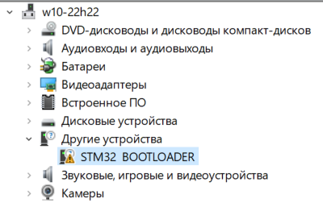

# Загрузка прошивки на STM32 по USB (DFU)

## Установка ПО

1. Необходимо скачать и установить `STM32CubeProgrammer` по [ссылке](https://www.st.com/en/development-tools/stm32cubeprog.html). Вместе с ней должны установиться все необходимые драйвера, но один из них не работал (по крайней мере, у меня).

2. Скачать утилиту для обновления USB-драйверов [Zadig](https://zadig.akeo.ie/#). Запускать пока не надо.

## Настройка STM32

1. Для перехода в режим прошивки подтянуть BOOT0 к "1", BOOT1 к "0" (подтяжка BOOT0 не обязательна, если вывод ни к чему не подключен, но желательна).
   
2. Подключить работающую `STM32` к компьютеру по USB.
   
3. Если в диспетчере задач устройство определено неверно (см. рисунок ниже), то выполнить пункт 4, иначе пункт 5.
   

4. Открыть `Zadig`, выбрать нужное устройство (`STM32 Bootloader`) и установить для него драйвер.
> TODO Добавить скрин с другого устройства

## Работа в STM32CubeProgrammer

В `STM32CubeProgrammer` необходимо выбрать файл прошивки.  
При сборке в `STM32CubeIDE` находится в папке `($ProjectName)\Debug\` или `($ProjectName)\Release\` с расширением `.elf`.  
<!-- При сборке в `Keil` находится в папке `` с расширением ``. -->

После успешной прошивки убрать подтяжки и сбросить контроллер (сброс питания или reset).

Подробно описывать работу не буду, приведу пару ссылочек:

1. [How to use STM32CubeProgrammer to access the USB-DFU bootloader](https://community.st.com/t5/stm32-mcus/how-can-i-use-stm32cubeprogrammer-to-access-the-usb-dfu/ta-p/49584)
2. [STM32CubeProgrammer software description](https://www.st.com/resource/en/user_manual/um2237-stm32cubeprogrammer-software-description-stmicroelectronics.pdf)

