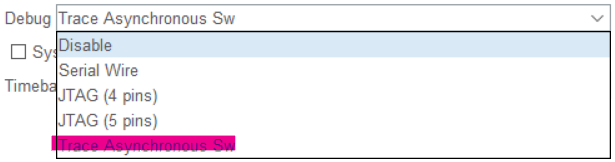
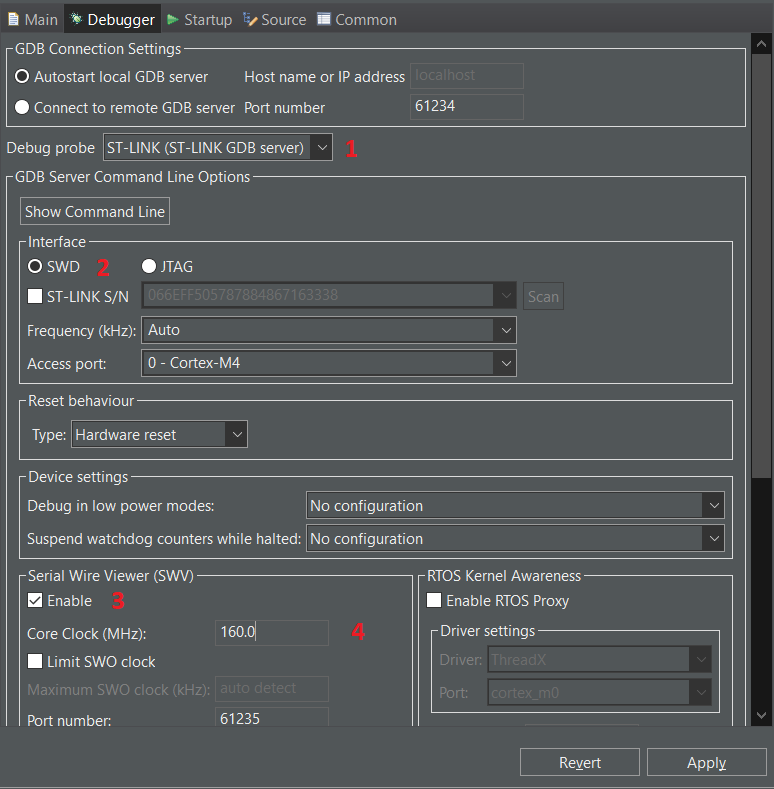
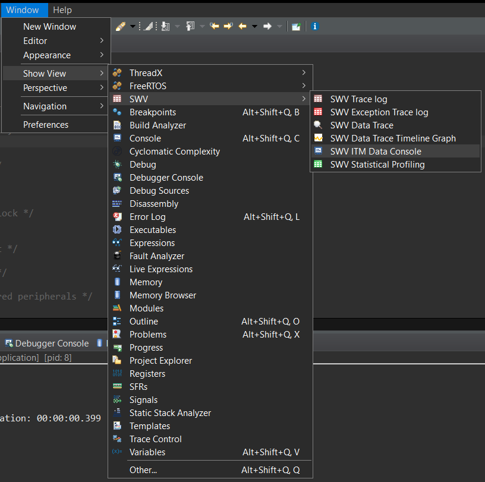
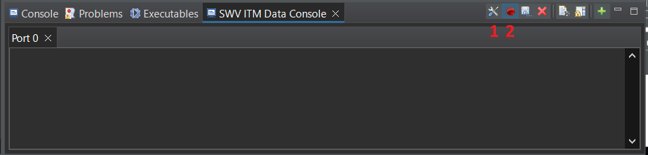
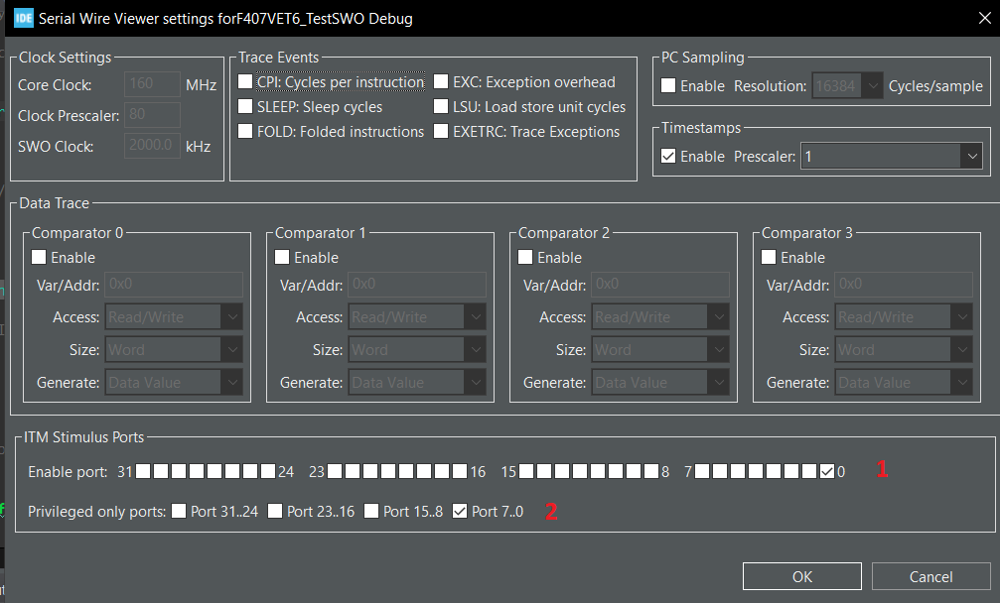
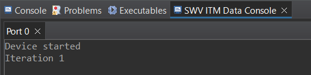

# Отладка по SWO в ARM Keil µVision v5.38

## Конфигурация контроллера

При конфигурации контроллера в `STM32CubeMX` или `STM32CubeIDE` для использования `SWO` необходимо выбрать опцию `Trace Asynchronous Sw` (использование интерфейса `SWD` с `SWO`).

  

Также во вкладке `Clock Configuration` необходимо уточнить значение тактовой частоты ядра (`Core Clock`), которое пригодится позже.


## Редактирование кода

Необходимо подключить библиотеку `stdio.h` и добавить определения регистров `DEMCR` (Debug Exception and Monitor Control Register) и битовой маски `TRCENA` (Global enable for all DWT and ITM features). Подробнее см. [здесь](https://developer.arm.com/documentation/ddi0403/d/Debug-Architecture/ARMv7-M-Debug/Debug-register-support-in-the-SCS/Debug-Exception-and-Monitor-Control-Register--DEMCR?lang=en "ARMv7-M Debug").

Для этого в файле `main.c` в нужных участках добавим следующий код:

```c
/* USER CODE BEGIN Includes */
#include <stdio.h>
/* USER CODE END Includes */
```

```c
/* USER CODE BEGIN PD */
#define DEMCR   (*((volatile unsigned long *)(0xE000EDFC)))
#define TRCENA  0x01000000
/* USER CODE END PD */
```

В этом же файле определим функцию для вывода отладочной информации.


```c
/* USER CODE BEGIN 4 */
int __io_putchar(int ch)
{
    ITM_SendChar(ch);
    return (ch);
}
/* USER CODE END 4 */
```

> Функция `__io_putchar` используется для вывода отладочной информации при отладке в `STM32CubeIde`. При использовании `Keil uVision` необходимо использовать другую функцию:
>
> ```c
> /* USER CODE BEGIN 4 */
>int fputc(int ch, FILE *f)
>{
>     if(DEMCR & TRCENA)
>     {
>         ITM_SendChar(ch);
>     }
>     return(ch);
>}
> /* USER CODE END 4 */
>```
> Функции не конфликтуют между собой, поэтому для универсальности можно писать так:
> ```c
>/* USER CODE BEGIN 4 */
>int fputc(int ch, FILE *f) 	// For Keil uVision
>{
>    if(DEMCR & TRCENA)
>    {
>        ITM_SendChar(ch);
>    }
>    return(ch);
>}
>
>int __io_putchar(int ch)	// For STM32CubeIDE
>{
>     ITM_SendChar(ch);
>     return (ch);
>}
>/* USER CODE END 4 */
>```
> Подробнее про работу с Keil uVision см. [здесь](/swo_keil.md).

Сама информация выводится с помощью функции `printf()`. Например, так:

```c
/* USER CODE BEGIN 2 */
printf(" Device started\n");
/* USER CODE END 2 */
```
> **Важно!** По неизвестной мне причине, первый символ самого первого сообщения не выводится, поэтому в коде выше первый символ - пробел.


## Настройка среды

### Настройка отладчика

Настройка производится в меню `Run -> Debug Configurations` во вкладке `Debugger`.



Необходимо установить следующие параметры:
1. Выбрать отладчик (я использую ST-Link на плате);
2. Выбрать инфтерфейс отладки (`SWD`);
3. Включить опцию `Serial Wire Viewer` (работа с `SWO`);
4. Установить частоту ядра (см. [здесь](#конфигурация-контроллера)).

После установки параметров нажать `Apply` и выйти из меню.

### Настройка отображения

Запустить режим отладки (`Run -> Debug` либо отдельной кнопкой на панели).

В нижней части экрана, где находится консоль, необходимо открыть окно `SWV ITM Data Console`. Для этого необходимо зайти в меню `Window -> Shov View -> SWV`, в котором выбрать `SWV ITM Data Console`.





Настроим отображение в этом окне. Для этого необходимо нажать на кнопку `Configure trace` (`1` на рисунке), после чего откроется меню `Serial Wire Viewer Settings for ...`.




В этом меню необходимо выбрать чекбокс `1` (включить ITM Port 0) и чекбокс `2`. После этого нажать `OK` для выхода из меню.

Для начала приёма данных необходимо начать запись данных, нажам на кнопку `Start Trace` (`2` на рисунке с консолью, красный круг).

Результат:


