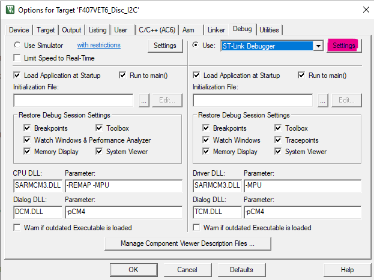
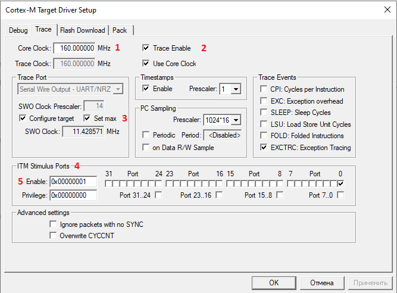
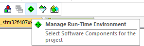
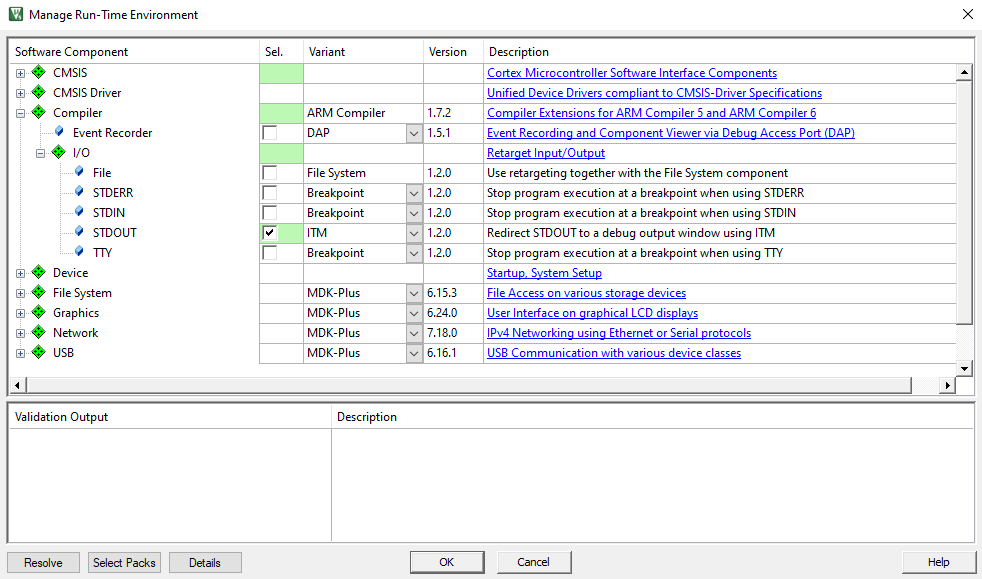
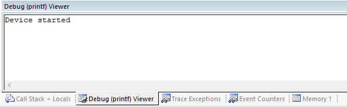

# Отладка по SWO в ARM Keil µVision v5.38

## Редактирование кода

Необходимо подключить библиотеку `stdio.h` и добавить определения регистров `DEMCR` (Debug Exception and Monitor Control Register) и битовой маски `TRCENA` (Global enable for all DWT and ITM features). Подробнее см. [здесь](https://developer.arm.com/documentation/ddi0403/d/Debug-Architecture/ARMv7-M-Debug/Debug-register-support-in-the-SCS/Debug-Exception-and-Monitor-Control-Register--DEMCR?lang=en "ARMv7-M Debug").

Для этого в файле `main.c` в нужных участках добавим следующий код:

```c
/* USER CODE BEGIN Includes */
#include <stdio.h>
/* USER CODE END Includes */
```

```c
/* USER CODE BEGIN PD */
#define DEMCR   (*((volatile unsigned long *)(0xE000EDFC)))
#define TRCENA  0x01000000
/* USER CODE END PD */
```

В этом же файле определим функцию для вывода отладочной информации.

```c
/* USER CODE BEGIN 4 */
int fputc(int ch, FILE *f)
{
   if(DEMCR & TRCENA)
   {
       ITM_SendChar(ch);
   }
   return(ch);
}
/* USER CODE END 4 */
```

Сама информация выводится с помощью функции `printf()`. Например, так:

```c
/* USER CODE BEGIN 2 */
printf(" Device started\n");
/* USER CODE END 2 */
```

> **Важно!** По неизвестной мне причине, первый символ самого первого сообщения не выводится, поэтому в коде выше первый символ - пробел.


## Настройка среды

### Настройка отладчика

Заходим в меню `Project -> Options for target "..."`.

Необязательные настройки (для удобства использования):

- Во вкладке `Target` в секции `Code generation` выбираем версию компилятора `V6.19` (в общем-то подойдёт любой установленный);
- Во вкладке `Output` установить галочку напротив опции `Create Batch File` (поможет покопаться в командах компилятора при необходимости);

Переходим во вкладку `Debug`. Здесь необходимо выбрать отладчик (я использую `ST-Link v2` на плате `Discovery`, поэтому выбираю `ST-Link Debugger`) и перейти в его настройки, нажав на кнопку `Settings`.



Во вкладке `Debug` убеждаемся, что наш отладчик определяется и переходим во вкладку `Trace`.



Здесь нужно произвести следующие изменения (см. [рисунок](imgs/options_debug_trace.png)):

1. Записать значение частоты ядра `Core Clock` (выбирается при конфигурации контроллера);
2. Включить опцию `Trace Enable`;
3. Выбрать частоту тактирования `SWO`. Здесь я ставлю `Set max`;
4. Выбрать используемые порты `ITM`. В нашем примере используется только `ITM Port 0`, поэтому остальные можно выключить, либо вручную сняв галочки, ...
5. ... либо занести значение 0x00000001 в соотвествующее поле.

### Настройка отображения

Заходим в окно `Manage Run-time Environment`:



Далее выбираем в списке `Compiler -> I/0` и настраиваем всё, как на скриншоте ниже.



Далее компилируем и собираем проект, после чего заходим в режим отладки. Здесь необходимо вывести окно с данными, полученными по SWO, на экран.

Для этого выбираем на верхней панели меню `View -> Serial Windows` и в нём включаем `Debug (printf) Viewer`.

 Viewer")

Готово!

